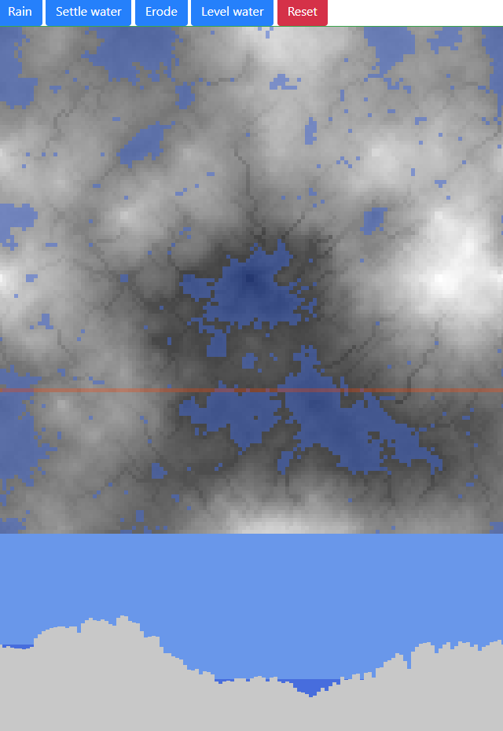

# landscape generator

generates a fractal landscape, running water and erosion.



## features

- rain
  - rain erosion
- erosion
  - smooth out / collapse
- settling of water
- leveling of water

thes efeatures are toggled with the buttons or using the r, s, l, e keys.

## landscape generation

to generate a world (2^n + 1) * (2^n + 1) using midpoint displacement.

```javascript
var w = world(7);
```

the method uses recursion randomly generating heights as we recurse deeper

```javascript
_scale = (n) => Math.exp(-n / 1.5)
```

## todo

- ux
  - make buttons show toggle status
  - add size, scaling and roughness controls
  - export function?
  - scaleable display (not fixed)
  - 3d representation?
- geology
  - improve algorithm for water erosion
  - improve algorithm for natural erosion
- javascript
  - optimise
  - parallel?

